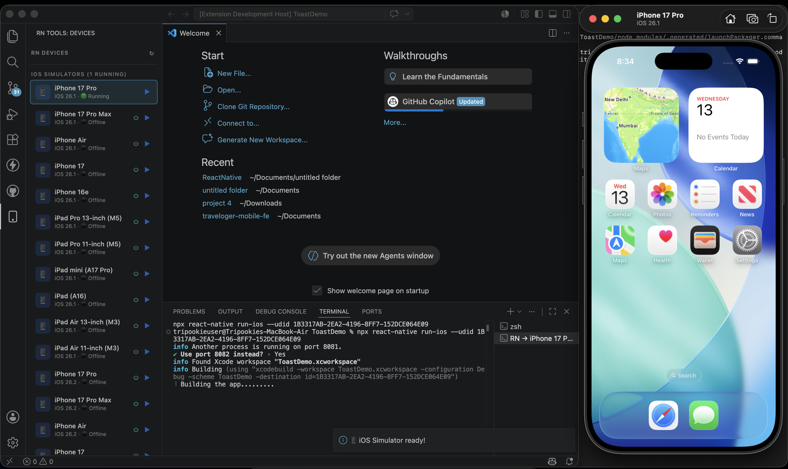
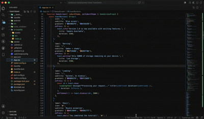
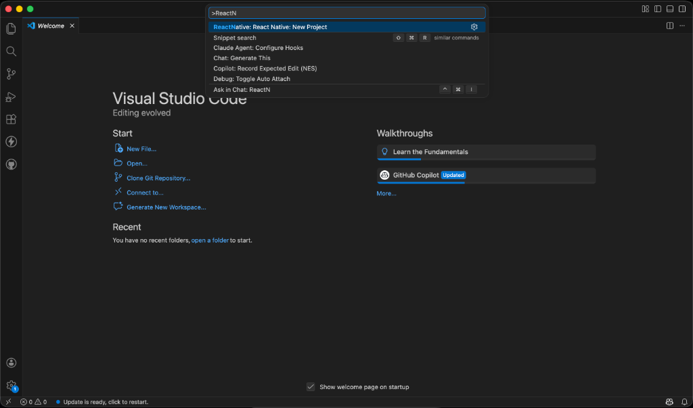
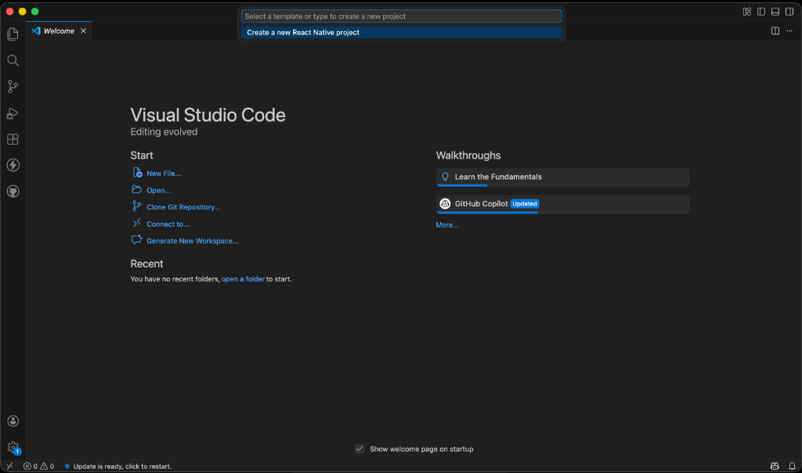
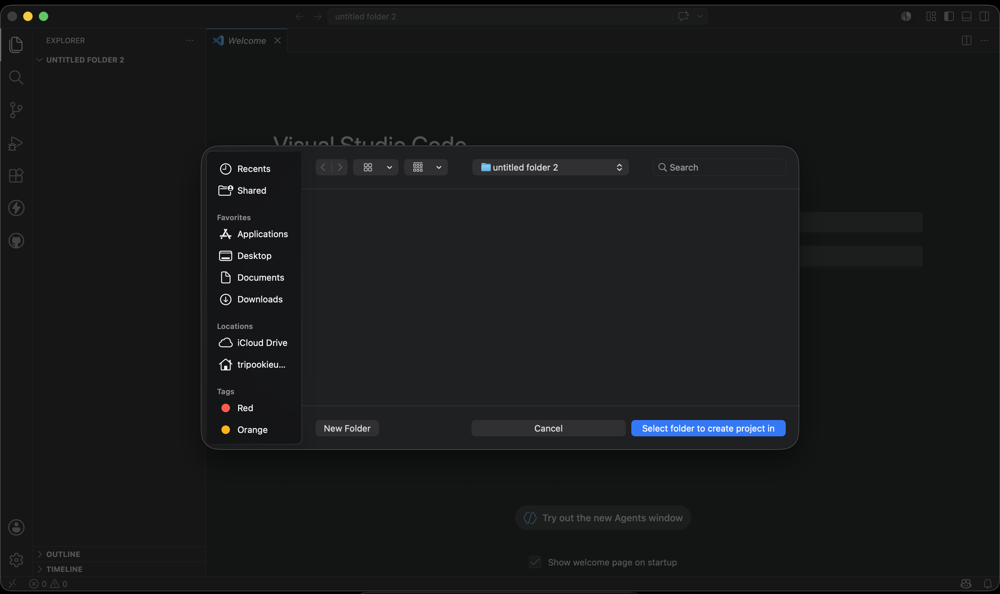
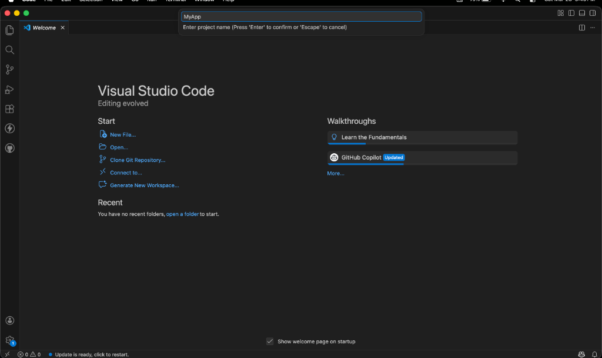
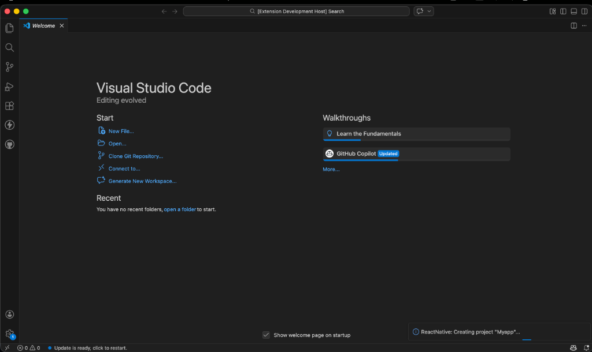
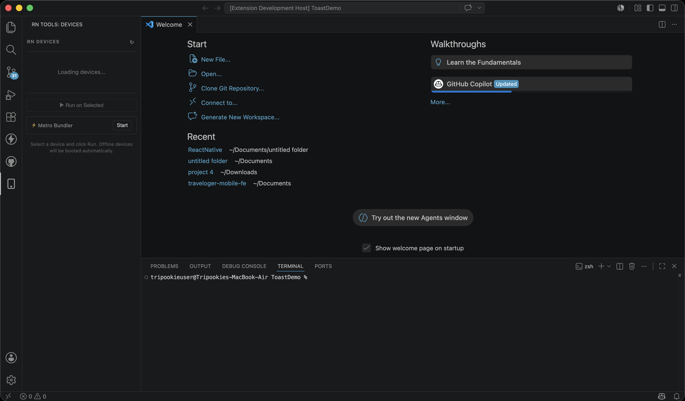
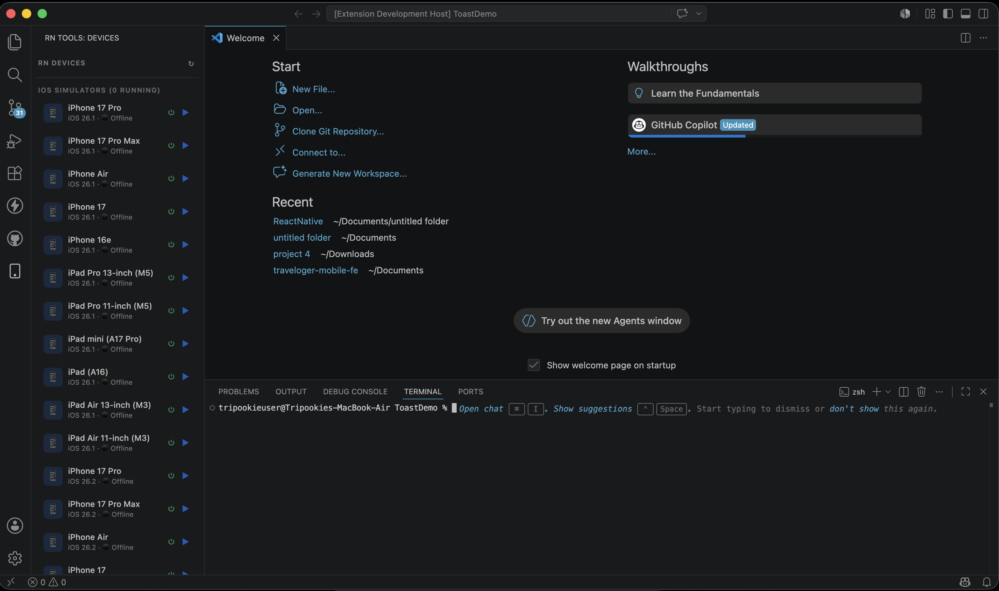
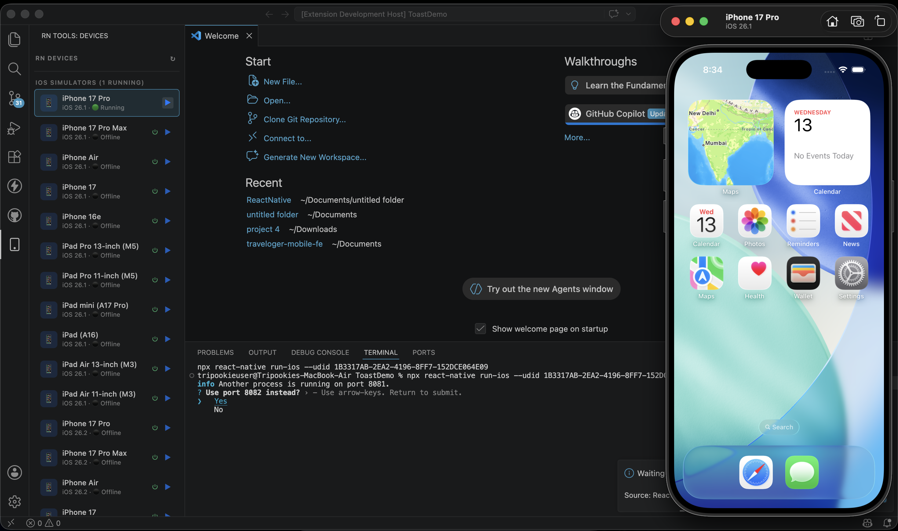

# ReactNative — VS Code Extension

The ultimate workspace companion for React Native CLI and Expo developers. Create projects, manage devices, and run your app — all from VS Code. Zero terminal commands. 🚀



---

## ✨ What's New in v1.3.7 — Memory Monitor & Leak Tester

Stop guessing where your memory leaks are! The new Memory Monitor hooks directly into the Hermes engine to provide real-time memory usage charts directly in VS Code. 

Even better, it includes a **Screen Leak Tester**. Drop a single hook into your React Navigation, and the extension will automatically track exactly how many megabytes are leaked every time you visit a screen, providing a detailed step-by-step timeline report! (`Cmd+Shift+P` -> `React Native: Open Memory Monitor`).

---

## ✨ What's New in v1.3.4 — Network Monitor (In-Editor DevTools)

Say goodbye to external network debuggers! The new Network Monitor lets you track all network requests (Fetch and Axios) directly inside a dedicated VS Code tab. Just type `Cmd+Shift+P` -> `React Native: Open Network Monitor` to inspect URLs, methods, headers, payloads, and responses natively!

## ✨ What's New in v1.3.0 — Real Physical Devices & Wireless Debugging

Connect your physical devices (iOS & Android) to VS Code via USB or Wi-Fi, run apps directly, and even control them from your desktop/laptop!

### 📡 Wireless Debugging & Pairing Wizard
Pair your Android device wirelessly using a QR code or standard 6-digit pairing code (Android 11+), or connect iOS devices wirelessly. No cables required.

### 🪞 Direct Device Mirroring & Interaction
Control your physical Android device directly from your laptop or desktop using integrated high-performance screen mirroring (`scrcpy`). Access and interact with your app in real-time.

### 🎬 Video Walkthrough (Real Devices)
See how you can connect your physical device, run the app, and operate it wirelessly from your computer:



---

## ✨ What's New in v1.1.0 — Device Manager

Run your React Native app directly from VS Code without opening Xcode, Android Studio, or typing a single terminal command.

### 📱 Device Manager Sidebar
A dedicated "RN Tools" panel in the Activity Bar that gives you full control over your development devices.

### 🎬 Video Guide
See the extension in action! Watch how easy it is to boot devices and run your app without leaving VS Code:


---

## Key Features

### 🧠 Memory Monitor (v1.3.6+)
- **Real-time Engine Stats**: Bypasses traditional dev tools by pulling instrumented stats directly from the Hermes engine.
- **High-Performance Charting**: Built on pure HTML5 Canvas to ensure 60fps tracking without eating your computer's RAM.
- **Screen Leak Profiler**: Tracks memory consumption *per screen* using React Navigation and provides a timeline report of exact MBs leaked during screen transitions.
- **Force GC**: Trigger garbage collection on-demand directly from VS Code.

### 📡 Network Monitor (v1.3.4)
- **In-Editor Network Tab**: Inspect network calls natively inside VS Code (`Cmd+Shift+P` -> `React Native: Open Network Monitor`).
- **Fetch & Axios Support**: Automatically intercepts both `fetch` and `XMLHttpRequest` calls inside your React Native app.
- **Deep Inspection**: View Method, Status, Duration, Request Headers, Request Body, and Response Body cleanly split into resizable panes.
- **Easy Setup**: Provides an easy copy-paste snippet to drop into your `App.js` with zero dependencies.

### 🔌 Physical Devices & Custom Commands (v1.3)
- **USB & Wi-Fi Support**: Detect and run your app on real iOS and Android physical devices.
- **Wireless Connection Wizard**: Connect to Android 11+ via Wi-Fi using QR codes or Pairing Codes.
- **Direct Desktop Mirroring**: View and interactively control your physical Android device directly from your laptop/desktop.
- **iOS Developer Pre-checks**: Automatic validation of Apple Developer signing profiles before running.
- **Custom Start Commands**: Customize the CLI launch command (useful for configurations requiring environment variables like `cross-env` or specific npm run scripts). Supports `${deviceId}` and `${deviceName}` placeholders.

### 🚀 Expo Support (v1.2)
- **Full Integration**: Complete support for Expo — from project creation to device boot and app execution.

### 🛠️ Project Creation (v1.0)
- **Command Palette Integration**: Create a new React Native project via `Cmd+Shift+P` → `React Native: New Project`
- **Interactive Setup**: Choose folder, name your project, and optionally install CocoaPods — all through native VS Code UI
- **Background Execution**: Projects initialize in the background with real-time progress notifications
- **Output Logging**: Monitor every step through the dedicated `ReactNative Creator` output channel

### 📱 Device Manager (v1.1)
- **Device Detection**: Automatically detects all available iOS Simulators and Android Emulators
- **One-Click Boot**: Boot any offline simulator or emulator directly from VS Code — no Xcode or Android Studio needed
- **One-Click Run**: Select a device and run your app with a single click
- **Auto Boot & Run**: Click Run on an offline device — the extension boots it first, then runs your app
- **Metro Bundler Control**: Start and stop the Metro Bundler from the sidebar
- **Auto Window Arrangement**: VS Code and the Simulator are automatically arranged side-by-side when the app launches (macOS and Windows)

---

## Visual Walkthrough

### Project Creation

#### 1. Start via Command Palette
Press `Cmd+Shift+P` and type **`React Native: New Project`**.



#### 2. Confirm Initialization
Confirm that you want to start a new project.



#### 3. Select Destination Folder
Choose the directory where you want to create your project.



#### 4. Name Your Project
Enter your desired application name (e.g., `MyAwesomeApp`).



#### 5. Background Progress
A native progress bar will tell you exactly what's happening.



---

### Device Manager

#### 6. Sidebar Panel — Loading
Open the "RN Tools" panel from the Activity Bar. The extension loads your available devices.



#### 7. Device List
All iOS Simulators and Android Emulators are listed with their OS version and status (Running / Offline).



#### 8. Boot & Run
Click the ▶ button on any device. If it's offline, the extension boots it automatically and then runs your app.



#### 9. Auto Window Arrangement
Once the simulator is ready, VS Code and the Simulator are automatically arranged side-by-side for the best coding experience.


---

## Configuration Settings

You can customize the commands executed by the extension when the Run button is clicked. Add the following options to your `.vscode/settings.json`:

| Setting | Type | Default | Description |
|---|---|---|---|
| `reactnative.customStartCommandAndroid` | `string` | `""` | Custom command for running the app on Android. Supports `${deviceId}` and `${deviceName}` placeholders. |
| `reactnative.customStartCommandIOS` | `string` | `""` | Custom command for running the app on iOS. Supports `${deviceId}` and `${deviceName}` placeholders. |

### Example Workspace configuration (`.vscode/settings.json`):
```json
{
  "reactnative.customStartCommandAndroid": "cross-env WITH_ROZENITE=true expo start --android",
  "reactnative.customStartCommandIOS": "cross-env WITH_ROZENITE=true expo start --ios"
}
```

---

## Requirements

- [Node.js](https://nodejs.org/) (Version 16 or later recommended)
- [React Native CLI](https://reactnative.dev/docs/environment-setup) correctly configured for your target platforms
- **iOS**: Xcode installed (for simulator runtime — you don't need to open it manually anymore!)
- **Android**: Android SDK with at least one AVD configured
- **macOS/Windows**: Recommended for full experience (auto window arrangement is supported on macOS and Windows)

## Platform Support

| Feature | macOS | Windows | Linux |
|---|:---:|:---:|:---:|
| Project Creation | ✅ | ✅ | ✅ |
| iOS Simulator Detection | ✅ | — | — |
| Android Emulator Detection | ✅ | ✅ | ✅ |
| One-Click Boot & Run | ✅ | ✅ | ✅ |
| Auto Window Arrangement | ✅ | ✅ | Coming Soon |
| CocoaPods Installation | ✅ | — | — |
| Physical Devices USB/Wi-Fi | ✅ | ✅ | ✅ |
| Direct Desktop Mirroring (scrcpy) | ✅ | ✅ | ✅ |

## Release Notes

### v1.3.7 (Latest)
- 🧠 **Timeline Accuracy Fix**: Improved screen leak timeline accuracy by automatically forcing garbage collection precisely when navigation occurs.
- 🧠 **Memory Monitor Educational UX**: Added intelligent navigation state tracking to the Screen Leak Profiler. The tool now distinguishes between true memory leaks and active screens retained in the navigation stack, providing friendly educational warnings instead of scary false positives.

### v1.3.6
- 🧠 **Memory Monitor**: Added a real-time Memory Monitor tab inside VS Code with a built-in Screen Leak Tester. Tracks exact megabytes leaked per React Navigation screen. Accessible via Command Palette (`React Native: Open Memory Monitor`).

### v1.3.5
- 🐛 **Missing Module Fix**: Fixed a critical bug where the `ws` (WebSocket) module was not bundled in the extension, causing activation failures for the Network Monitor.

### v1.3.4
- 📡 **Network Monitor**: Added a native Network Monitor tab inside VS Code. Intercept and debug `fetch` and `Axios` network calls directly from your editor. Accessible via Command Palette (`React Native: Open Network Monitor`).
- 🐛 **Blob Response Fixes**: Bulletproofed network interceptors to handle binary data without crashing.

### v1.3.3
- 🐛 **macOS Window Arrangement**: Resolved macOS auto-arrange window failures that occurred when running inside a Development Host or using alternative IDE versions (e.g., Cursor).

### v1.3.2
- 🐛 **Webview Loading Handshake**: Fixed race condition where sidebar view reopened stuck in the loading stage.
- 🤖 **Android Emulator Path Detection**: Automatically searches for the emulator binary under standard Android SDK paths on Windows, resolving issues where emulators were not listed.

### v1.3.1
- ⚙️ **Custom Start Commands**: Added support for overriding the start/run commands via VS Code settings (e.g. for projects requiring custom env variables like Rozenite). Supports `${deviceId}` and `${deviceName}` variables.

### v1.3.0
- 🔌 **Physical Device Support**: Auto-detect physical iPhones and Android devices connected via USB or Wi-Fi.
- 📡 **Wireless Debugging**: Connect Android devices wirelessly using QR codes or pairing codes without needing a cable.
- 🪞 **Direct Desktop Mirroring**: Control and mirror your physical Android device directly from your laptop via `scrcpy`.
- 🔑 **iOS Signing Pre-checks**: Alerts developers about required Apple Developer signing configurations before attempting to run on real devices.

### v1.2.0
- 🚀 **Expo Support**: Added full support for Expo project creation, device booting, and app execution.
- 🪟 **Windows Auto Window Arrangement**: VS Code and Android Emulators are now automatically arranged side-by-side on Windows!

### v1.1.0
- 📱 **Device Manager**: Full sidebar panel with device detection, one-click boot, and run
- 🪟 **Auto Window Arrangement**: VS Code + Simulator automatically arranged side-by-side (macOS)
- ⚡ **Metro Bundler Control**: Start/Stop Metro from the sidebar
- 🤖 **Android AVD Support**: Detect and launch offline Android emulators

### v1.0.0
- 🛠️ Initial release with project creation via Command Palette
- 📦 CocoaPods auto-installation support for macOS
- 📊 Background progress notifications

---

**Built for Developers, by Developers.** Stop switching between VS Code, Xcode, Android Studio, and the terminal. Stay in the code. Stay productive. ⚡
